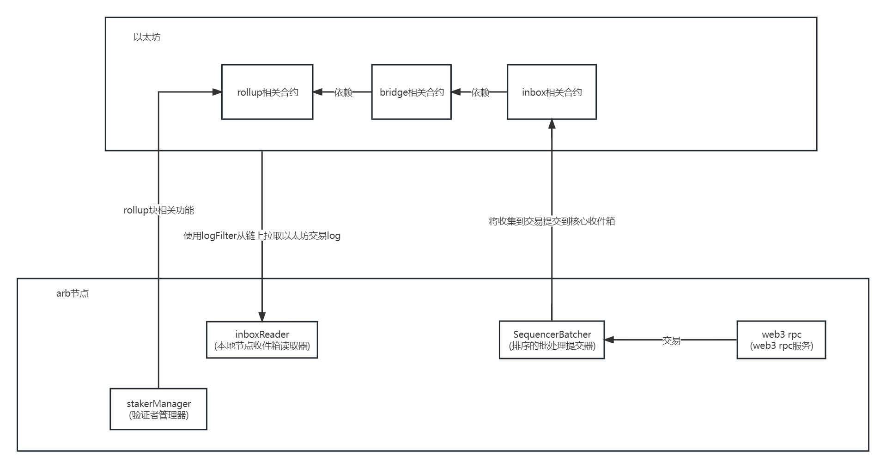

#  Arbitrum 调研

## 整体流程



### 模块简介

#### 链上

部署在以太坊的合约

1. rollup相关合约:

   功能: 构造rollup块,解决块冲突,质押管理

2. bridge相关合约:

   功能: 维护一条rollup hash列表,收集以太坊跨到arb的交易信息,维护自己的消息hash列表

3. inbox相关合约:

   功能: 维护arb的消息hash列表, arb节点的消息收集器

4. outbox相关合约:

   功能: 没有在节点之中找到关联的操作,


#### 链下

arb节点

1. inboxReader:

   功能:  
   拉取以太坊的交易log,构建桥合约发件箱的交易,发给avm,avm存到本地

2. sequencerBatcher:

   功能:  
   1. 接收rpc发过来的交易,加工之后发给avm处理(执行),然后存到本地  
   2. 发布本地的消息到inbox合约之中

3. rpcServer:

   功能:  
   web3功能的服务

4. stakerManager:

   功能:  
   1. 创建rollup块
   2. 处理挑战
   3. 确认rollup块


整体流程  
模拟一笔交易:
1. 调用Rpc发起部署合约
2. 交易发到了batcher之中,被avm执行了,结果存到了arbos之中,
3. inboxReader在不停的从以太坊之中同步交易,也就是本地arbos之中
4. 然后到了某个时间,arbos就把交易打包发到inbox合约上
5. 合约校验通过就生成一个发件信息的hash入列表
6. staker会不停的执行以下其中的步骤之一
    1. 创建块
    2. 发起挑战
    3. 解决挑战
    4. 确认块
    5. 转移到已存在的块

ps. 块和收件箱的关联都是通过本地获取收件箱或者自己维护的数据构建入参,传到合约上构建块或者完成块,
因此收件箱如果数据不对或者顺序不对,构建的块或者去提供给验证是会出错的

---

## 验证逻辑

1. batcher提交信息到合约的收件箱之中,合约中验证
2. staker调用rollup中的完成块方法,合约中验证
3. staker调用rollup中的创建新块方法,合约中验证


## 其他:
Hash algorithm:

hash算法(流程)

1. 交易:
    
      ```jsonc
      keccak256(abi.encodePacked(acc, count, prefixHash, messageDataHash));
      uint256 processedItems = 0;
      uint256 dataOffset;
      for (uint256 i = 0; i + 5 <= sectionsMetadata.length; i += 5) {
        bytes32 prefixHash = keccak256(
                    abi.encodePacked(msg.sender, sectionsMetadata[i + 1], sectionsMetadata[i + 2])
                );
        uint256 numItems = sectionsMetadata[i];
        offset = dataOffset;
        count = messageCount;
        acc = beforeAcc;
        itemCount = lengthsOffset + numItems;
        for (uint256 i = processedItems; i < itemCount; i++) {
            uint256 length = lengths[i];
            bytes32 messageDataHash;
            assembly {
                messageDataHash := keccak256(offset, length)
            }
            acc = keccak256(abi.encodePacked(acc, count, prefixHash, messageDataHash));
            offset += length;
            count++;
        }
        processedItems += numItems;
      }
      ```

    根据sectionsMetadata得长度遍历,hash就计算几次,然后根据sectionsMetadata和lengths再次遍历计算,遍历次数是lengthsOffset~sectionsMetadata[i]
2. 块:
  ```jsonc
    SoliditySHA3(hasSiblingByte[:], lastHash[:], executionHash[:], batchEndAcc[:])
    hasSiblingByte: [1]byte{0}
    lastHash:stakerInfo.LatestStakedNodeHash
    executionHash:
      func (a *Assertion) ExecutionHash() common.Hash {
        return BisectionChunkHash(
          a.Before.TotalGasConsumed,
          new(big.Int).Sub(a.After.TotalGasConsumed, a.Before.TotalGasConsumed),
          a.BeforeExecutionHash(),
          a.AfterExecutionHash(),
        )
      }
      func BisectionChunkHash(
        segmentStart *big.Int,
        segmentLength *big.Int,
        startHash common.Hash,
        endHash common.Hash,
      ) common.Hash {
        return hashing.SoliditySHA3(
          hashing.Uint256(segmentStart),
          hashing.Uint256(segmentLength),
          hashing.Bytes32(startHash),
          hashing.Bytes32(endHash),
        )
      }
    batchEndAcc: GetAfterAcc

  ```
Signature algorithm:

签名算法(流程)

交易(收件箱信息)
1. 使用的以太坊RawSignatureValues来签名

块
1. 以太坊默认transact方法里边得签名


Serialization algorithm

序列化算法(流程)
